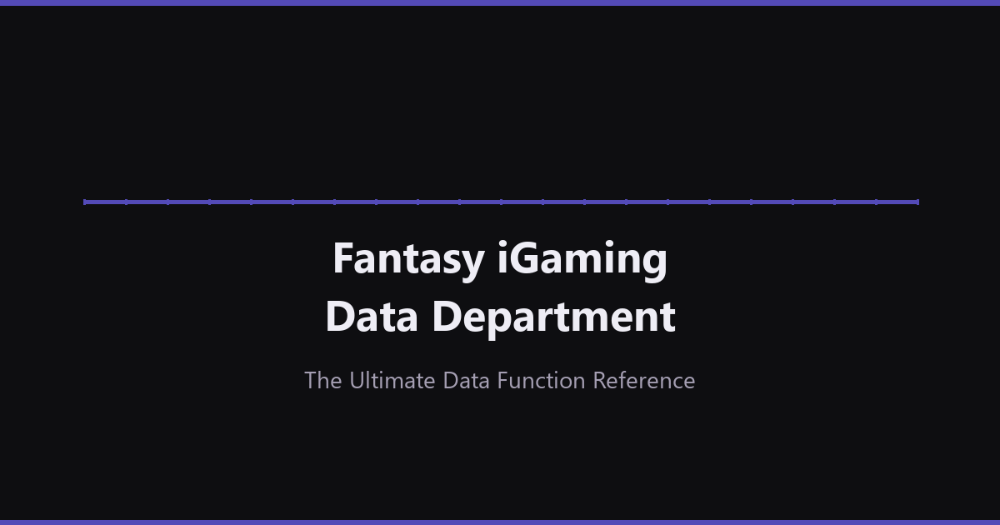

# Fantasy iGaming Data Department

Open-source interactive reference for building a data function in an iGaming company.



## What is this

A detailed, fictional but realistic portrayal of how a data department operates inside an iGaming company — **Fantasy iGaming LTD** (Sportsbook + Casino, ~500K MAU, ~$5M NGR/month, 20-person data team). The site covers 19 sections spanning the entire data function: from architecture and data model to A/B testing, FinOps, and team onboarding. Content is in Russian; code, comments, and this README are in English.

**[Live Demo](https://cosmiksoul.github.io//fantasy-igaming-data-department/)**

## Sections

1. **Data Architecture** — Tech stack, data flow, infrastructure overview
2. **Org Structure** — Team composition, roles, streams, and reporting lines
3. **Data Model** — Staging, intermediate, and mart layers with naming conventions
4. **Event Taxonomy** — Tracking plan, event naming, and payload standards
5. **Metrics Dictionary** — KPI definitions, formulas, SQL examples, benchmarks
6. **Data Governance** — Ownership, access control, PII handling, data quality
7. **SLA** — Service-level agreements for pipelines, dashboards, and reports
8. **DataOps** — CI/CD, orchestration, testing, monitoring for data pipelines
9. **MLOps** — Model lifecycle, feature store, training, deployment, monitoring
10. **Data Lineage** — End-to-end lineage tracking and impact analysis
11. **Incident Response** — Playbooks, severity levels, on-call, post-mortems
12. **Dashboards** — BI layer, dashboard catalog, self-service analytics
13. **A/B Testing** — Experimentation platform, statistical methods, processes
14. **Management** — Stakeholder management, prioritization, planning
15. **Onboarding** — New hire guides, 30-60-90 plans, knowledge base
16. **FinOps** — Cloud cost management, budgeting, optimization
17. **Roadmap** — Quarterly plans, initiative tracking, maturity model
18. **Glossary** — Key terms and definitions
19. **About** — Project background and author info

## Tech Stack

- Pure HTML / CSS / JS — no frameworks, no npm, no build tools
- [Google Fonts](https://fonts.google.com/) (DM Sans, JetBrains Mono)
- [Mermaid.js](https://mermaid.js.org/) for diagrams
- Each page < 100 KB

## Local Development

No build step required. Open `index.html` directly in a browser, or serve locally:

```bash
python -m http.server 8000
```

Then visit `http://localhost:8000`.

## Author

**Константин Гупалов** — [LinkedIn](https://www.linkedin.com/in/konstantin-gupalov/)

## License

[CC BY 4.0](https://creativecommons.org/licenses/by/4.0/)

## Contributing

Issues and pull requests are welcome.
